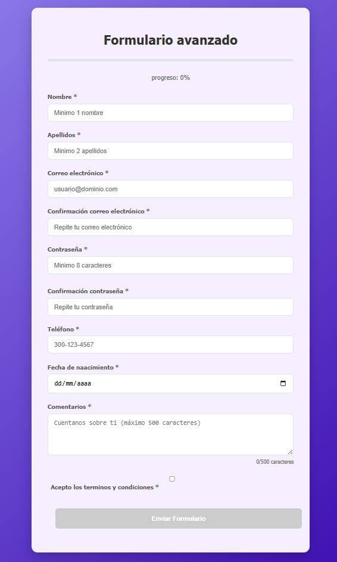

# Formulario con Validación Avanzada

 <!-- Reemplazar con imagen real si disponible -->

Formulario web interactivo con validación en tiempo real, indicador de progreso y visualización de fortaleza de contraseña.

## Características ✨

- ✅ Validación en tiempo real por campo
- 📊 Barra de progreso dinámica
- 🔐 Indicador visual de fortaleza de contraseña
- 🔄 Confirmación de email y contraseña
- 📅 Validación de edad (18+ años)
- 📝 Contador de caracteres para comentarios
- 📋 Resumen de datos al enviar

## Campos del Formulario

| Campo | Tipo | Validación |
|-------|------|------------|
| Nombre | Texto | 3-20 carácteres, mínimo 1 nombre |
| Apellidos | Texto | 3-40 carácteres, mínimo 2 apellidos |
| Email | Email | Formato válido |
| Confirmar Email | Email | Coincidencia |
| Contraseña | Password | Mínimo 8 carácteres |
| Confirmar Contraseña | Password | Coincidencia |
| Teléfono | Tel | Formato 300-123-4567 |
| Fecha Nacimiento | Date | Edad 18-100 años |
| Comentarios | Textarea | Máximo 500 carácteres |
| Términos | Checkbox | Obligatorio |

## Tecnologías Utilizadas

- **HTML5**: Estructura semántica
- **CSS3**: Animaciones y diseño responsive
- **JavaScript**: Lógica de validación

## Autor

Trabajo realizado por Maria Fernanda Moreno Acosta de la ficha 3147235